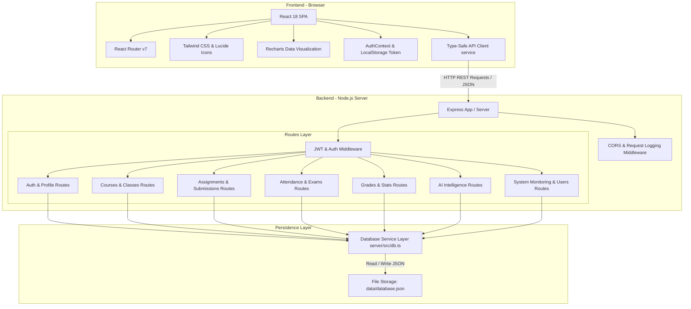

# EduAI — Education Management Portal


**An AI-powered education management platform connecting students, teachers, and administrators with academic management, analytics, and personalized academic intelligence.**

EduAI bridges institutional management and personalized learning through a modern web interface powered by React 18, TypeScript, Tailwind CSS, and a lightweight Node.js/Express REST backend. The system unifies course scheduling, assignment submissions, automated evaluation, attendance tracking, examination management, GPA calculations, and rule-based AI academic insights for all institutional stakeholders.

* **Repository:** [https://github.com/praveen2007-VY/Buildathon1](https://github.com/praveen2007-VY/Buildathon1)

---

## Navigation

- [Overview](#overview)
  - [What is EduAI?](#what-is-eduai)
  - [User Roles & Capabilities](#user-roles--capabilities)
- [AI Academic Intelligence](#ai-academic-intelligence)
- [Architecture](#architecture)
- [Technology Stack](#technology-stack)
- [Feature Matrix](#feature-matrix)
- [Project Structure](#project-structure)
- [Prerequisites](#prerequisites)
- [Installation](#installation)
- [Environment Configuration](#environment-configuration)
- [Database Setup & Persistence](#database-setup--persistence)
- [Running the Application](#running-the-application)
- [Usage Workflows](#usage-workflows)
- [API Documentation](#api-documentation)
- [API Example](#api-example)
- [Authentication & Authorization](#authentication--authorization)
- [Testing & Quality Verification](#testing--quality-verification)
- [Code Quality & Architecture Standards](#code-quality--architecture-standards)
- [Contributing](#contributing)
- [Coding Standards](#coding-standards)
- [Security](#security)
- [License](#license)
- [Changelog](#changelog)
- [Troubleshooting / FAQ](#troubleshooting--faq)
- [Support](#support)
- [Roadmap](#roadmap)

---

## Overview

### What is EduAI?

Educational institutions face complex operational challenges in coordinating course delivery, monitoring student progress, managing assessments, and identifying academic risk factors before students fall behind.

**EduAI** addresses these challenges by providing a central, role-scoped education portal that manages:

- **Students & Teachers** directory and profile management
- **Courses & Class Schedules** with enrollment tracking
- **Assignments & Submissions** with grading workflows
- **Attendance Records** with subject-level metrics
- **Examinations & Online Quizzes** with real-time scoring
- **Grades & Academic Records** with GPA calculations
- **Academic Analytics & Reports** for departmental overview
- **AI-Powered Academic Insights** for risk mitigation and recommendations

---

### User Roles & Capabilities

EduAI strictly scopes access and capabilities into three distinct user roles:

```text
               ┌──────────────────────────────────────────────┐
               │           EduAI Management Portal            │
               └──────────────────────┬───────────────────────┘
                                      │
         ┌────────────────────────────┼────────────────────────────┐
         │                            │                            │
         ▼                            ▼                            ▼
┌──────────────────┐        ┌──────────────────┐        ┌──────────────────┐
│     Student      │        │     Teacher      │        │  Administrator   │
└──────────────────┘        └──────────────────┘        └──────────────────┘
```

#### Student

Students interact with an intuitive dashboard focused on learning progression and personal academic metrics:

- **Access Courses:** View enrolled subjects, syllabus details, and course progression.
- **Submit Assignments:** View upcoming tasks, attach submission content, and check evaluation results.
- **Check Attendance:** Monitor overall and subject-specific attendance percentages with monthly trends.
- **View Examinations:** Access upcoming test schedules, launch interactive practice quizzes, and inspect results.
- **View Grades:** Review term grades, completed subject credits, target vs actual performance, and GPA.
- **Track Progress:** Monitor academic trajectory across semesters.
- **Receive AI Recommendations:** Access personalized study suggestions, subject focus areas, and learning action items.

#### Teacher

Teachers manage course delivery, track student performance, and execute grading workflows:

- **Manage Courses & Classes:** Review active teaching loads, class schedules, and student rosters.
- **Record Attendance:** Conduct daily roll calls, update attendance statuses, and review historic logs.
- **Create Assignments:** Publish assignment tasks, specify submission deadlines, and monitor completion rates.
- **Evaluate Submissions:** Inspect student submissions, enter scores, provide feedback, and utilize AI-generated evaluation suggestions.
- **Conduct Examinations:** Schedule tests, review class average scores, and inspect detailed item distributions.
- **Enter Grades:** Manage student grade entries, update assignment/exam scores, and export performance reports.
- **Monitor Student Performance & AI Insights:** Identify weak topics and at-risk students for early intervention.

#### Administrator

Administrators maintain high-level institutional oversight and system integrity:

- **Manage Students & Teachers:** Add, edit, query, filter, and maintain active user directories.
- **Manage Courses & Classes:** Oversee institutional curriculum, class assignments, and department mappings.
- **Manage Assignments & Examinations:** Audit assessment workloads across all active academic programs.
- **Manage Grades & Generate Reports:** Review institutional grade distributions, export performance data, and monitor academic trends.
- **View Institutional Analytics & AI Insights:** Inspect high-risk/medium-risk student distributions, department performance comparisons, and predicted intervention demands.
- **Monitor System Activity:** Review system event logs, user authentication audits, database synchronization status, and server health.

---

## AI Academic Intelligence

EduAI includes a dedicated academic intelligence engine engineered to transform raw educational data into actionable insights for students, teachers, and administrators.

```text
┌────────────────────────┐      ┌────────────────────────┐      ┌────────────────────────┐
│ Student Intelligence   │      │ Teacher Intelligence   │      │  Admin Intelligence    │
├────────────────────────┤      ├────────────────────────┤      ├────────────────────────┤
│ • Weak-Subject Alert   │      │ • Weak-Topic Analysis  │      │ • Risk Distribution    │
│ • Attendance Warning   │      │ • At-Risk Identification│     │ • Department Metrics   │
│ • Study Recommendations│      │ • Recommended Action   │      │ • System Interventions │
└────────────────────────┘      └────────────────────────┘      └────────────────────────┘
```

### Student Intelligence

- **Weak-Subject Detection:** Automatically identifies subjects falling below target grade thresholds.
- **Attendance Risk Calculation:** Alerts students when attendance drops toward critical boundaries.
- **Personalized Recommendations:** Generates targeted study guides, practice drills, and focus recommendations based on assignment scores.
- **Performance Trends:** Tracks monthly progress against target targets.

### Teacher Intelligence

- **Class Performance Analysis:** Measures aggregate comprehension across course modules.
- **Weak-Topic Detection:** Pinpoints specific curriculum concepts where students struggle most (e.g., *Dynamic Programming*, *SQL Joins*, *Normal Forms*).
- **At-Risk Student Identification:** Categorizes students into `High Risk`, `Medium Risk`, and `Low Risk` tiers based on attendance, performance, and assignment delinquency.
- **Recommended Interventions:** Provides suggested action plans (remedial sessions, targeted peer tutoring, review workshops).

### Admin Intelligence

- **Institutional Risk Distribution:** Aggregates macro-level risk metrics across the student body.
- **Department & Class Comparisons:** Compares term-over-term performance across Computer Science, Business, Engineering, and Arts departments.
- **Strategic Recommendations & Interventions:** Computes estimated intervention workload requirements and model consistency parameters.

> **Implementation Note:**
> The current AI capability uses deterministic rule-based algorithms, threshold evaluation logic, database aggregation pipelines, and pre-configured feedback templates executed within the Express server (`/api/ai` endpoints). No external LLM services (such as OpenAI or Anthropic) are connected in the base implementation. Future LLM integration can easily plug into the existing AI service layer abstraction (`server/src/routes/ai.ts`).

---

## Architecture

The EduAI portal follows a decoupled, two-tier architecture comprising a client-side Single Page Application (SPA) and a lightweight REST API backend with JSON-based file persistence.



### Layer Descriptions

- **Frontend Application Layer:** Built with React 18, TypeScript, and Vite. Renders role-specific dashboards (`StudentLayout`, `TeacherLayout`, `AdminLayout`, `PublicLayout`) and handles state management, routing, and charts.
- **API & Routing Layer:** Express.js routing engine providing structured JSON API endpoints under `/api/*`.
- **Authentication & Middleware Layer:** Evaluates JSON Web Tokens (`jwt.verify`), hashes credentials with `bcryptjs`, and enforces role-based endpoint security (`requireRole`).
- **Business Logic & AI Engine:** Implements core application domain logic including GPA calculations, attendance rollups, quiz scoring, and AI risk scoring.
- **Database & Persistence Layer:** Custom, atomic JSON file-backed database layer (`server/src/db.ts`) operating on `data/database.json`. Automatically initializes schema structure if empty or absent.

---

## Technology Stack

| Layer | Technology | Version | Purpose |
| --- | --- | --- | --- |
| **Frontend Core** | [React](https://react.dev/) | `^18.3.1` | UI Component Framework |
| **Language** | [TypeScript](https://www.typescriptlang.org/) | `~5.7.2` | Static Type Safety |
| **Build Tool** | [Vite](https://vitejs.dev/) | `^6.1.0` | Fast Development Server & Production Bundler |
| **Styling** | [Tailwind CSS](https://tailwindcss.com/) | `^3.4.17` | Utility-First CSS Styling |
| **PostCSS** | [PostCSS](https://postcss.org/) / [Autoprefixer](https://github.com/postcss/autoprefixer) | `^8.5.2` / `^10.4.20` | CSS Preprocessing & Vendor Prefixing |
| **Routing** | [React Router DOM](https://reactrouter.com/) | `^7.1.5` | Client-Side Navigation & Protected Routes |
| **Data Visualization** | [Recharts](https://recharts.org/) | `^2.15.1` | Analytics & Risk Charts |
| **Icons** | [Lucide React](https://lucide.dev/) | `^0.475.0` | Modern UI Icons |
| **Styling Helpers** | `clsx` / `tailwind-merge` | `^2.1.1` / `^3.0.1` | Dynamic Class Management |
| **Backend Framework** | [Express](https://expressjs.com/) | `^4.21.2` | Node.js REST API Web Server |
| **Backend Runtime** | [tsx](https://github.com/privatenumber/tsx) | `^4.19.3` | TypeScript Execution Engine for Node.js |
| **Authentication** | [jsonwebtoken](https://github.com/auth0/node-jsonwebtoken) | `^9.0.2` | Stateless JWT Auth Tokens |
| **Password Hashing** | [bcryptjs](https://github.com/dcodeIO/bcrypt.js) | `^2.4.3` | Password Hashing & Verification |
| **Middleware** | [cors](https://github.com/expressjs/cors) / [dotenv](https://github.com/motdotla/dotenv) | `^2.8.5` / `^16.4.7` | Cross-Origin Requests & Environment Variables |
| **Storage** | File Storage (`fs`) | Native | JSON-based persistent database (`data/database.json`) |

---

## Feature Matrix

| Feature Module | Student | Teacher | Administrator |
| --- | :---: | :---: | :---: |
| **Course Catalog & Details** | View & Enroll | Create & Edit | Full System Management |
| **Class Schedule & Roster** | View Personal Schedule | Manage Active Classes | Manage All Classes |
| **Assignments & Submissions** | Submit Work | Create & Grade | Oversee All Assignments |
| **Automated Feedback Generation** | View Received Feedback | Generate AI Feedback | Audit System Feedback |
| **Attendance Management** | View Progress & Summaries | Record & Update | System Attendance Audit |
| **Exams & Quiz Simulation** | Take Quizzes & View Scores | Schedule & Manage | Oversee Examinations |
| **Gradebook & GPA Calculation** | View Transcripts & GPA | Enter & Edit Grades | Manage All Academic Records |
| **AI Insights & Recommendations** | Personal Recommendations | Weak Topics & At-Risk List | Institutional Risk Analytics |
| **Reports & Analytics** | Term Progress Chart | Class Trend Analytics | Departmental Reports |
| **System Monitoring & Logs** | — | — | Server Logs & Health Audits |
| **User Directory Management** | Own Profile | Own Profile | Manage Students & Teachers |

---

## Project Structure

```text
Buildathon1/
├── data/
│   └── database.json              # File-backed database storage
├── dist/                          # Production build distribution output
├── server/                        # Express backend source code
│   └── src/
│       ├── db.ts                  # Database persistence driver & initial schema
│       ├── index.ts               # Server entry point, middleware & route loader
│       ├── types.ts               # Backend data structures & interfaces
│       ├── middleware/
│       │   └── auth.ts            # JWT authentication & RBAC middleware
│       └── routes/
│           ├── ai.ts              # AI insights & feedback endpoints
│           ├── assignments.ts     # Assignments & submissions management
│           ├── attendance.ts      # Student & teacher attendance endpoints
│           ├── auth.ts            # User authentication (login, register, me)
│           ├── classes.ts         # Class schedule management
│           ├── courses.ts         # Course catalog & enrollment
│           ├── exams.ts           # Exam creation, listing & quiz submission
│           ├── grades.ts          # Grade records & transcript management
│           ├── stats.ts           # Role-based dashboard statistics
│           ├── system.ts          # System monitoring & health metrics
│           └── users.ts           # User directory & profile updates
├── src/                           # React frontend source code
│   ├── App.tsx                    # Top-level application component
│   ├── index.css                  # Global Tailwind CSS imports
│   ├── main.tsx                   # React DOM entry point
│   ├── components/                # Reusable UI component modules
│   │   ├── admin/                 # Admin widgets & institutional cards
│   │   ├── ai/                    # AI recommendation & insight cards
│   │   ├── charts/                # Risk distribution & performance charts
│   │   ├── common/                # Headers, sidebars, protected route wrappers
│   │   ├── tables/                # At-risk student tables
│   │   └── teacher/               # Active courses & teacher cards
│   ├── context/
│   │   └── AuthContext.tsx        # Authentication state & session context
│   ├── data/                      # Client-side fallback data definitions
│   ├── layouts/                   # Admin, Teacher, Student, and Public page layouts
│   ├── pages/                     # Application page views
│   │   ├── admin/                 # Admin management & analytics views
│   │   ├── public/                # Home, Courses, Contact, Login, Register
│   │   ├── student/               # Student dashboard, courses, grades, AI recs
│   │   └── teacher/               # Teacher dashboard, attendance, grading, AI
│   ├── routes/
│   │   └── AppRouter.tsx          # Application routing definitions
│   ├── services/
│   │   └── api.ts                 # Centralized type-safe API client
│   └── types/
│       └── index.ts               # Frontend TypeScript interfaces
├── .gitignore                     # Git exclusion rules
├── CHANGELOG.md                   # Project version history
├── index.html                     # HTML page template
├── package.json                   # Dependencies, scripts, and package metadata
├── package-lock.json              # Dependency lockfile
├── postcss.config.js              # PostCSS plugins configuration
├── README.md                      # Primary project documentation
├── tailwind.config.js             # Tailwind CSS theme configuration
├── tsconfig.json                  # Application TypeScript compiler config
├── tsconfig.node.json             # Vite Node environment TS configuration
└── vite.config.ts                 # Vite bundler configuration
```

---

## Prerequisites

Before running EduAI locally, ensure your environment meets the following requirements:

- **Node.js:** `>= 18.0.0` (Node.js `20.x` or higher recommended)
- **npm:** `>= 9.0.0` (or `yarn` / `pnpm` equivalent)
- **Browser:** Modern Evergreen Browser (Chrome, Firefox, Edge, Safari)

---

## Installation

Follow these steps to set up the EduAI workspace locally:

### 1. Clone Repository

```bash
git clone https://github.com/praveen2007-VY/Buildathon1.git
cd Buildathon1
```

### 2. Install Dependencies

Install all required frontend and backend dependencies:

```bash
npm install
```

---

## Environment Configuration

EduAI operates with sensible default fallbacks out of the box, but environment variables can be configured using a `.env` file in the project root.

### Backend Environment Variables

| Variable | Description | Default Fallback |
| --- | --- | --- |
| `PORT` | HTTP port for backend Express server | `5000` |
| `JWT_SECRET` | Secret key used to sign and verify JWT authentication tokens | `eduai_super_secret_jwt_key_2026` |

### Environment Security Best Practices

- **Never commit `.env` files or credentials to git repositories.**
- Use unique, high-entropy secrets for `JWT_SECRET` in production environments.
- Frontend environment variables consumed by Vite must be prefixed with `VITE_`.

---

## Database Setup & Persistence

EduAI uses a file-backed JSON database mechanism (`data/database.json`) managed by `server/src/db.ts`.

- **Automatic Initialization:** If `data/database.json` does not exist or is empty when the server starts, the database layer creates it automatically.
- **Seeded Demo Accounts:** The repository includes pre-seeded user accounts for rapid evaluation:

| Account Type | Email | Password | Role |
| --- | --- | --- | --- |
| **Student** | `venkat@gmail.com` | *(Account password set during registration)* | `student` |
| **Teacher** | `praveen@gmail.com` | *(Account password set during registration)* | `teacher` |

*Note: New accounts created via the `/register` view are immediately appended to `data/database.json` with bcrypt-hashed passwords.*

---

## Running the Application

EduAI provides convenient npm scripts to launch development services or construct production builds.

### Development Mode (Recommended)

Run the backend server and frontend development server concurrently:

```bash
npm run dev:all
```

- **Frontend Application:** Available at `http://localhost:5173`
- **Backend REST API:** Running at `http://localhost:5000/api`

### Standalone Backend Server

To run only the Express backend server:

```bash
npm run server
```

### Standalone Frontend App

To run only the Vite frontend dev server:

```bash
npm run dev
```

### Production Build & Preview

To type-check, build, and preview the static production output:

```bash
# Type check and build bundle
npm run build

# Preview production build locally
npm run preview
```

---

## Usage Workflows

### Student Workflow

```text
  [Login / Register]
          │
          ▼
  [Student Dashboard] ──────► Inspect Overview & Quick Stats
          │
          ├─────────────────► [My Courses & Schedule] View enrolled subjects & timetable
          │
          ├─────────────────► [Assignments] Submit solutions & view teacher scores
          │
          ├─────────────────► [Attendance] Track subject-specific attendance percentages
          │
          ├─────────────────► [Exams & Quizzes] Launch interactive tests & check scores
          │
          ├─────────────────► [Grades & Progress] View semester transcript & GPA
          │
          └─────────────────► [AI Recommendations] Access targeted study suggestions
```

### Teacher Workflow

```text
  [Teacher Login]
          │
          ▼
  [Teacher Dashboard] ──────► Inspect Class Metrics & Action Items
          │
          ├─────────────────► [Classes & Courses] Manage active teaching modules
          │
          ├─────────────────► [Attendance Management] Mark daily student attendance
          │
          ├─────────────────► [Assignments] Publish tasks & evaluate student submissions
          │
          ├─────────────────► [Grades Management] Enter exam/assignment scores
          │
          └─────────────────► [AI Insights] Review weak topics & at-risk student list
```

### Administrator Workflow

```text
  [Admin Login]
          │
          ▼
  [Admin Dashboard] ────────► Monitor System Health & High-Level Metrics
          │
          ├─────────────────► [User Management] Manage Student & Teacher directories
          │
          ├─────────────────► [Academic Management] Oversee Courses, Classes, Exams
          │
          ├─────────────────► [Reports & Analytics] View department performance comparison
          │
          ├─────────────────► [Institutional AI] Analyze student risk distributions
          │
          └─────────────────► [System Monitoring] Audit system logs & sync health
```

---

## API Documentation

When the backend server is running (`npm run server` or `npm run dev:all`), the base REST API is served under `http://localhost:5000/api`.

### Base Endpoints

- **Health Check:** `GET /api/health`
- **Authentication:** `POST /api/auth/login`, `POST /api/auth/register`, `GET /api/auth/me`
- **Courses:** `GET /api/courses`, `POST /api/courses`, `PUT /api/courses/:id`, `DELETE /api/courses/:id`, `POST /api/courses/:id/enroll`
- **Classes:** `GET /api/classes`, `POST /api/classes`, `PUT /api/classes/:id`, `DELETE /api/classes/:id`
- **Assignments:** `GET /api/assignments`, `POST /api/assignments`, `POST /api/assignments/:id/submit`, `GET /api/assignments/submissions/all`, `PUT /api/assignments/submissions/:id/grade`
- **Attendance:** `GET /api/attendance/student`, `GET /api/attendance/teacher`, `POST /api/attendance/mark`
- **Exams:** `GET /api/exams`, `POST /api/exams`, `POST /api/exams/submit`
- **Grades:** `GET /api/grades/student`, `GET /api/grades/teacher`, `PUT /api/grades/teacher/:id`
- **AI Insights:** `GET /api/ai/recommendations`, `GET /api/ai/weak-topics`, `GET /api/ai/institutional-insights`, `POST /api/ai/generate-feedback`
- **Stats & System:** `GET /api/stats/student`, `GET /api/stats/teacher`, `GET /api/stats/admin`, `GET /api/system/monitoring`, `POST /api/system/sync`
- **Directories:** `GET /api/students`, `POST /api/students`, `PUT /api/students/:id`, `DELETE /api/students/:id`, `GET /api/teachers`, `POST /api/teachers`, `PUT /api/teachers/:id`, `DELETE /api/teachers/:id`

---

## API Example

### Health Check Endpoint

```http
GET /api/health HTTP/1.1
Host: localhost:5000
```

#### Response (`200 OK`)

```json
{
  "status": "ok",
  "timestamp": "2026-08-16T12:00:00.000Z",
  "service": "EduAI Academic Portal Backend",
  "version": "1.0.0"
}
```

---

### User Authentication Endpoint

```http
POST /api/auth/login HTTP/1.1
Host: localhost:5000
Content-Type: application/json

{
  "email": "venkat@gmail.com",
  "password": "samplepassword"
}
```

#### Response (`200 OK`)

```json
{
  "token": "eyJhbGciOiJIUzI1NiIsInR5cCI6IkpXVCJ9.eyJpZCI6InN0ZF8xNzg2ODc1MDU3MzE4IiwiZW1haWwiOiJ2ZW5rYXRAZ21haWwuY29tIiwicm9sZSI6InN0dWRlbnQiLCJpYXQiOjE3ODY4NzUwNTcsImV4cCI6MTc4NzQ3OTg1N30...",
  "user": {
    "id": "std_1786875057318",
    "name": "venkatesh",
    "email": "venkat@gmail.com",
    "role": "student",
    "avatar": "https://images.unsplash.com/photo-1535713875002-d1d0cf377fde?w=150&auto=format&fit=crop&q=80",
    "title": "Undergraduate Student",
    "department": "School of Computing",
    "studentId": "EDU-7759",
    "semester": "Fall Semester 2024",
    "createdAt": "2026-08-16T10:10:57.318Z"
  }
}
```

---

### Institutional AI Insights Endpoint

```http
GET /api/ai/institutional-insights HTTP/1.1
Host: localhost:5000
Authorization: Bearer <your_jwt_token>
```

#### Response (`200 OK`)

```json
{
  "riskDistribution": [
    { "name": "Low Risk", "value": 10583, "percentage": 100, "color": "#0058be" },
    { "name": "Medium Risk", "value": 1494, "percentage": 0, "color": "#4648d4" },
    { "name": "High Risk", "value": 374, "percentage": 0, "color": "#ba1a1a" }
  ],
  "departmentPerformance": [
    { "department": "Comp Sci", "currentTerm": 75, "previousTerm": 60 },
    { "department": "Business", "currentTerm": 65, "previousTerm": 70 },
    { "department": "Arts", "currentTerm": 60, "previousTerm": 55 },
    { "department": "Engineering", "currentTerm": 85, "previousTerm": 80 }
  ],
  "institutionalSummary": {
    "predictedInterventionsNeeded": 12,
    "modelAccuracy": "94.8%",
    "lastAnalyzed": "10 minutes ago"
  }
}
```

---

## Authentication & Authorization

EduAI implements standard JWT-based authentication and role-based access control (RBAC):

1. **Authentication Token:** Issued upon successful POST to `/api/auth/login` or `/api/auth/register`. Tokens contain `id`, `email`, and `role` claims, signed with `JWT_SECRET` (valid for 7 days).
2. **Authorization Header:** Clients send requests with the standard HTTP header:
   ```text
   Authorization: Bearer <token>
   ```
3. **Server Security Middleware:** Handled in `server/src/middleware/auth.ts`:
   - `authenticate`: Validates JWT token and binds the user object to `req.user`.
   - `requireRole(...roles)`: Enforces role permissions (e.g. `requireRole('teacher', 'admin')`).
4. **Client-Side Security:** Managed by `AuthContext.tsx` and `<ProtectedRoute allowedRoles={[...]} />`. Unauthenticated requests redirect to `/login`.

---

## Testing & Quality Verification

Automated backend unit/integration test suites (e.g. Jest or PyTest) are not currently configured in this repository.

To verify type safety and build integrity, use the following workspace validation commands:

```bash
# 1. Type check TypeScript files without emitting code
npx tsc --noEmit

# 2. Execute full TypeScript compile and Vite production build
npm run build

# 3. Run ESLint code quality checks
npm run lint
```

---

## Code Quality & Architecture Standards

The EduAI codebase is built following industry best practices:

- **Strict TypeScript Typing:** Interface definitions separated cleanly in `server/src/types.ts` and `src/types/index.ts`.
- **Decoupled API Client:** Centralized HTTP request handling in `src/services/api.ts` with typed responses and error boundaries.
- **Component Modularity:** UI elements separated into role-specific folders (`components/admin`, `components/ai`, `components/teacher`, `components/tables`, `components/charts`).
- **Role-Based Layouts:** Isolated visual navigation wrappers (`StudentLayout`, `TeacherLayout`, `AdminLayout`).
- **Input Validation:** Password verification via bcryptjs and server-side request body checks.

---

## Contributing

We welcome contributions to EduAI! Follow these steps to submit improvements:

### Workflow

1. Fork the repository on GitHub.
2. Create a feature branch off `main`:
   ```bash
   git checkout -b feature/attendance-bulk-update
   ```
3. Implement changes ensuring code adheres to project standards.
4. Run validation checks (`npx tsc --noEmit` and `npm run build`).
5. Commit your changes using conventional commit messages.
6. Push to your branch and open a Pull Request.

### Recommended Commit Conventions

```text
feat: add bulk attendance update endpoint
fix: resolve grade total calculation edge case
docs: update API documentation and installation guide
refactor: streamline AI insights calculation logic
style: improve dashboard dark mode contrast
```

---

## Coding Standards

### Frontend Standards

- Written in TypeScript using functional React components.
- Use Tailwind CSS utility classes; avoid inline styles.
- Keep components small, reusable, and focused on single responsibilities.
- Isolate API client calls inside `src/services/api.ts`.
- Handle loading and error states gracefully in UI components.

### Backend Standards

- Express routes organized cleanly inside `server/src/routes/`.
- Validate all incoming request payloads before performing storage operations.
- Enforce server-side role checks on all sensitive endpoints.
- Return consistent JSON response formats with appropriate HTTP status codes.

---

## Security

EduAI incorporates key security principles:

- **Password Security:** All user passwords are salted and hashed using `bcryptjs` before storage.
- **Token Security:** JWT tokens signed with secret key validation.
- **Role-Based Access Control:** All administrative and teaching endpoints require explicit role claims.
- **Input Sanitization:** Strings are trimmed and lowercased where appropriate to prevent duplicate account creation.

> **Reporting Security Issues:** If you discover a security vulnerability in EduAI, please open a issue or contact maintainers via repository channels. Do not publicly disclose vulnerabilities until resolved.

---

## License

This project does not currently include an explicit open-source license. Until a license is added, reuse and redistribution rights should not be assumed.

---

## Changelog

See [CHANGELOG.md](CHANGELOG.md) for detailed version history and release notes.

---

## Troubleshooting / FAQ

### 1. Port 5000 or 5173 is already in use

- **Cause:** Another process is running on port 5000 (backend) or 5173 (Vite frontend).
- **Fix:** Terminate the conflicting process or specify a custom port in `.env`:
  ```env
  PORT=5001
  ```

### 2. Frontend cannot connect to backend API

- **Cause:** Backend server is not running or running on an unexpected port.
- **Fix:** Ensure backend is running using `npm run dev:all` or `npm run server`. Check server startup logs for base URL (`http://localhost:5000/api`).

### 3. Login fails with invalid password

- **Cause:** Incorrect credentials or unregistered account.
- **Fix:** Register a new account via the `/register` page or use seeded user credentials.

### 4. Database reset or initial file missing

- **Cause:** `data/database.json` was deleted or corrupted.
- **Fix:** Restart the server (`npm run server`). The database driver will automatically recreate `data/database.json` with fresh initial schema.

### 5. Build fails during `npm run build`

- **Cause:** TypeScript type mismatches or syntax errors.
- **Fix:** Run `npx tsc --noEmit` to inspect the exact TypeScript error and fix the affected component or module.

---

## Support

For questions, issues, or feature requests, please open an issue in the official GitHub repository:

- **Issue Tracker:** [https://github.com/praveen2007-VY/Buildathon1/issues](https://github.com/praveen2007-VY/Buildathon1/issues)

---

## Roadmap

- [ ] PostgreSQL / Database ORM integration option for enterprise scale.
- [ ] Integration with external LLM providers (e.g. OpenAI GPT-4 / Google Gemini API) for custom student tutoring.
- [ ] Automated end-to-end testing suite with Vitest / Playwright.
- [ ] Push notifications for assignment deadlines and exam schedules.